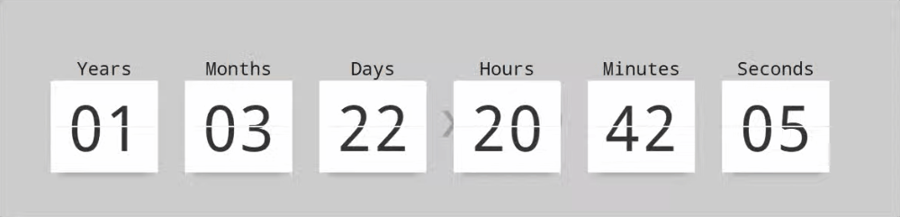

# voothanh-react-countdown-flip

> A 3D animated flip countdown component for React.

<div align="center">
    
</div>

## Install
````bash
npm install --save voothanh-react-countdown-flip
````
#### Or
````bash
yarn add voothanh-react-countdown-flip
````

## Props

The <code>FlipClockCountdown</code> has all properties of `div` and additional props below

| Name           |                   Type                    | Required |        Default         | Description                                   |
|:---------------|:-----------------------------------------:| :------: |:----------------------:|:----------------------------------------------|
| **target**     | <code>Date&#124;string&#124;number</code> |   yes    |                        | <code>Date</code> or timestamp in the future. |
| **display**    |            <code>object</code>            |    no    |                        | Config Timer Unit displays                    |
| \|*years*      |           <code>boolean</code>            |    no    | <code>undefined</code> | Display Years                                 |
| \|*months*     |           <code>boolean</code>            |    no    | <code>undefined</code> | Display Months                                |
| \|*days*       |           <code>boolean</code>            |    no    | <code>undefined</code> | Display Days                                  |
| \|*hours*      |           <code>boolean</code>            |    no    | <code>undefined</code> | Display Hours                                 |
| \|*minutes*    |           <code>boolean</code>            |    no    | <code>undefined</code> | Display Minutes                               |
| \|*seconds*    |           <code>boolean</code>            |    no    | <code>undefined</code> | Display Seconds                               |
| **titles**     |            <code>object</code>            |    no    |                        | Config Unit titles                            |
| \|*years*      |            <code>string</code>            |    no    |   <code>Years</code>   | Title Years                                   |
| \|*months*     |            <code>string</code>            |    no    |  <code>Months</code>   | Title Months                                  |
| \|*days*       |            <code>string</code>            |    no    |   <code>Days</code>    | Title Days                                    |
| \|*hours*      |            <code>string</code>            |    no    |   <code>Hours</code>   | Title Hours                                   |
| \|*minutes*    |            <code>string</code>            |    no    |  <code>Minutes</code>  | Title Minutes                                 |
| \|*seconds*    |            <code>string</code>            |    no    |  <code>Seconds</code>  | Title Seconds                                 |
| **onComplete** |             <code>func</code>             |    no    |                        | Callback when countdown ends                                      |


## Usage

### Basic usage

```tsx
import React from 'react';
import { Timer } from "voothanh-react-countdown-flip";

const Example = () => {
    return <Timer target={'2026-01-17 12:00:00'}
                  display={{
                      [TimeUnit.Seconds]: true,
                      [TimeUnit.Hours]: true,
                      [TimeUnit.Minutes]: true
                  }}
    />;
}
```